# Sigma Jello for Fabric

Minecraft Sigma Client UI port & base remake for Fabric 1.16.5.

## TODO List
- [ ] All other modules
- [ ] Commands(+ base)
- [ ] ViaVersion fixes
- [ ] Add MS alt token refresher;
- [ ] Separate managers into trackers, processors, storages...

## Screenshots

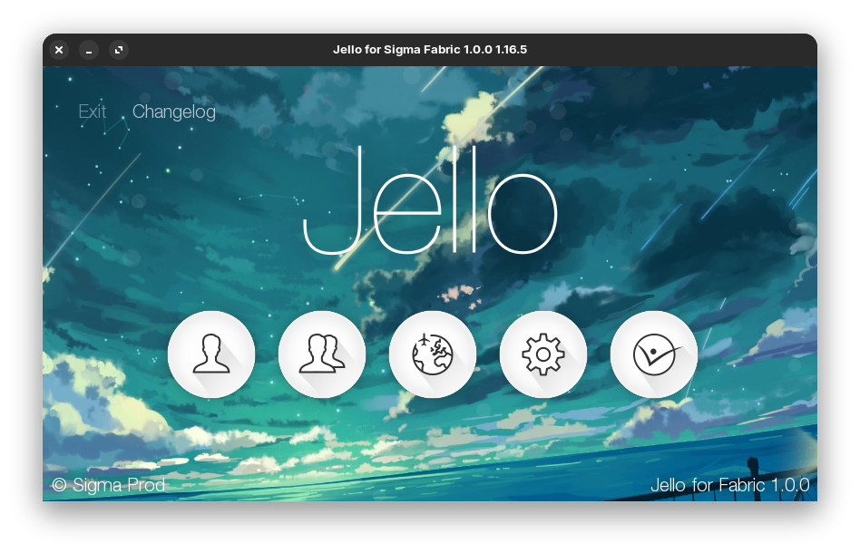
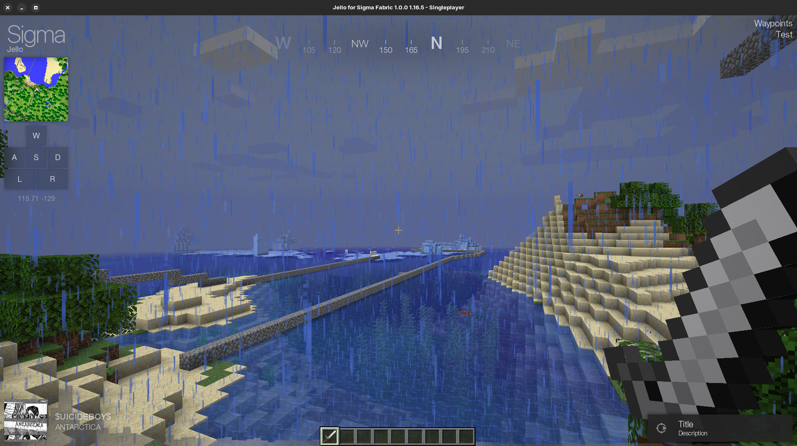
**Use built in playlists**
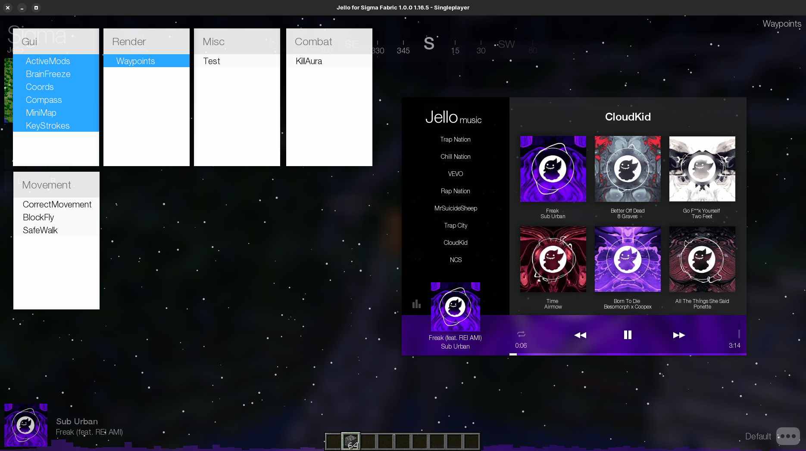
**Search for your own music!**
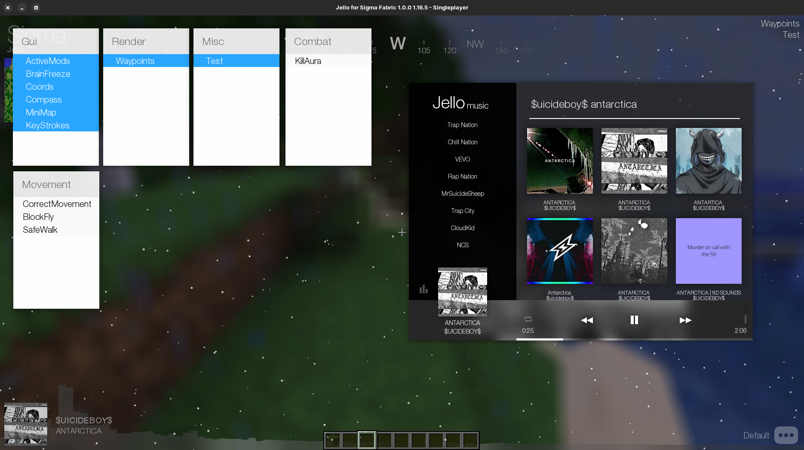
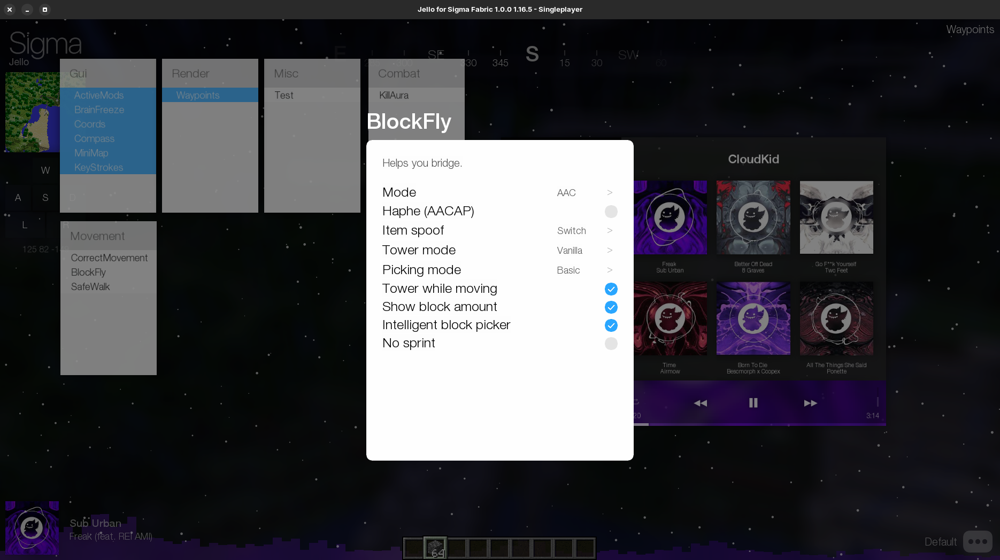
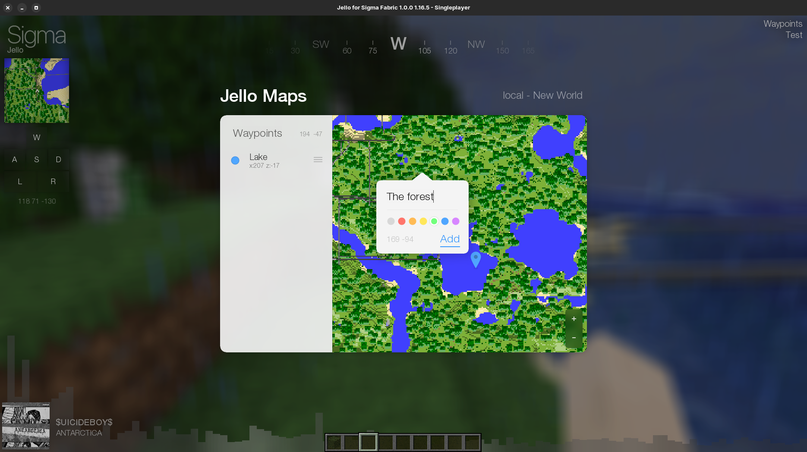
**Enjoy the little things**
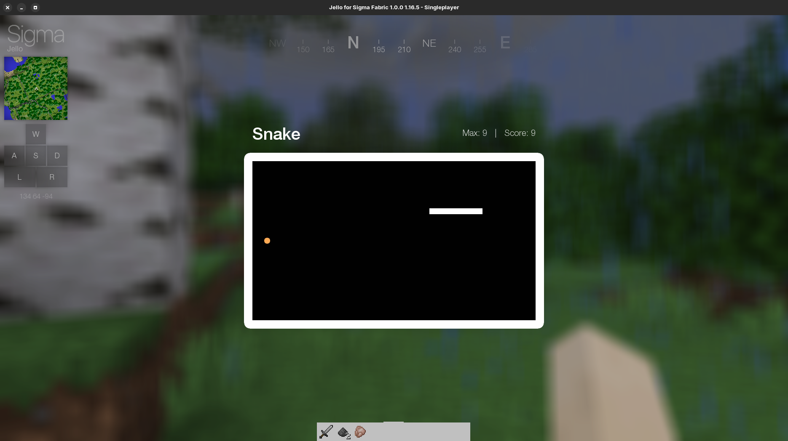
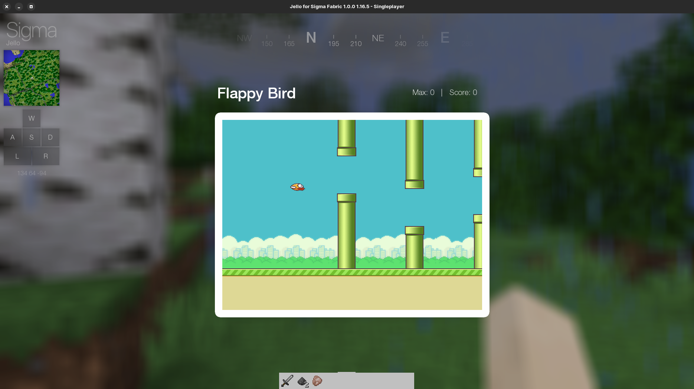
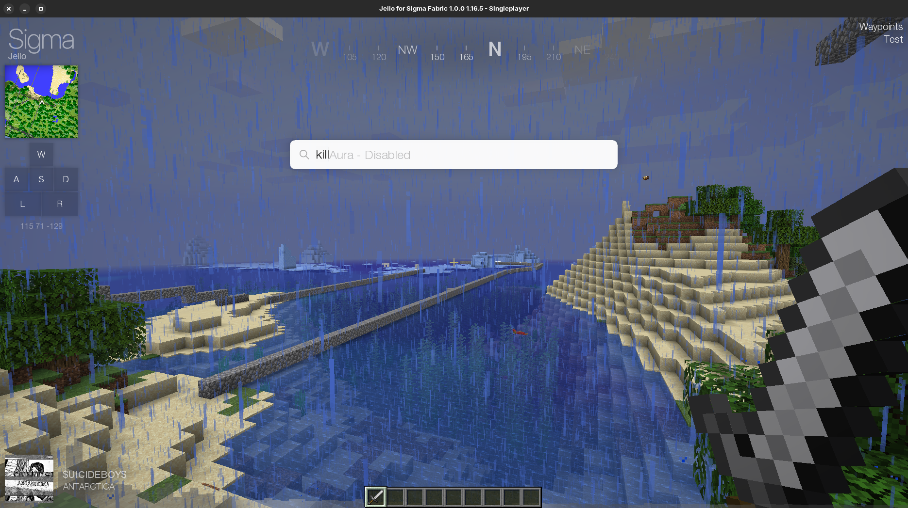
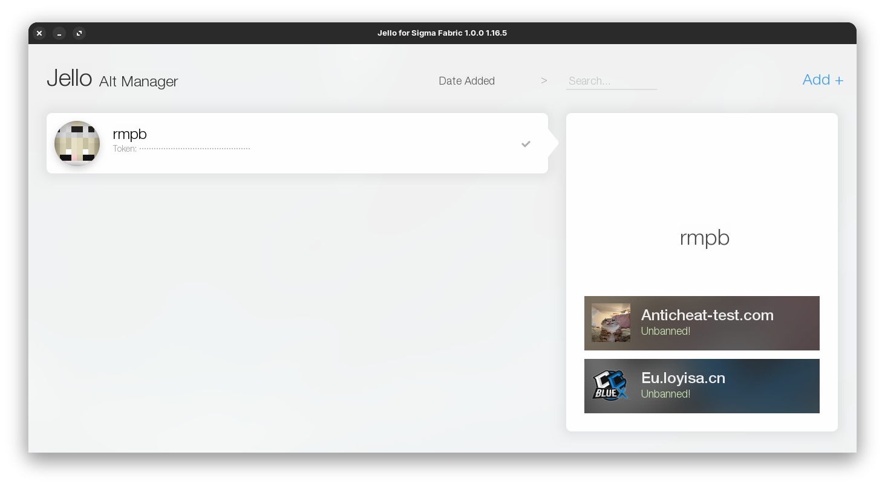
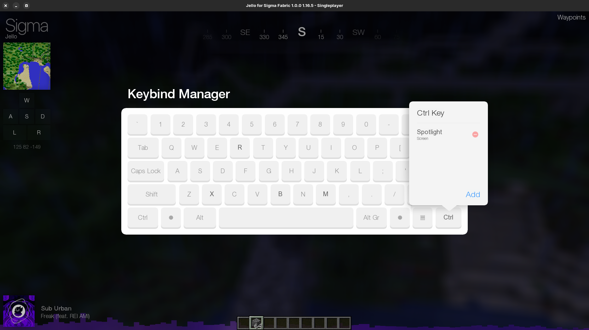
**Change and access Jello options**
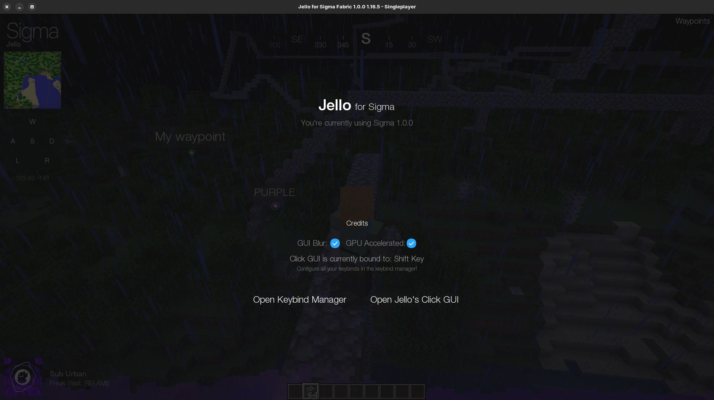
