# Sigma Jello for Fabric

Minecraft Sigma Client UI port & base remake for Fabric 1.16.5.

## TODO List
- [ ] All other modules;
- [ ] Commands(+ base);
- [ ] ViaVersion fixes;
- [ ] Add MS alt token refresher;
- [ ] Separate managers into trackers, processors, storages...

## Workflow
- When writing modules, we follow a simple pattern:
  1. constructor;
  2. onEnable/onDisable;
  3. events(starting from the shortest code to longest); 
  4. private/public methods used in the class;
  5. static methods;
  6. static classes.
- When writing mixins, we also have very simple rules:
  1. if method is annotated with @Inject its name should be ``inject**MethodWe'reInjectingInto**``, etc.;
  2. if method is annotated with @Unique, we don't append any unique flag to it;
  3. don't use the pattern ``remake$**Method**`` - it's bad practice; 
  4. don't write weird accessors, use the accesswidener;
  5. call your mixin classes ``Mixin**ClassName**``.
- When porting code from the old base over to here:
  1. don't just paste it - refactor it, rework it, rename it;
  2. try and make the result 1:1, but not the code;
  3. make pull requests for them.
- Other basic patterns you should follow here:
  1. utility classes should be named ``Entity**Utils**``, ``File**Utils**`` - append **Utils**, not **Util**, not **Utility**;
  2. try not to overuse Lombok. it's recommended to only use it for classes than need constructors;
  3. don't use ``System.out.println``, instead use ``Client.LOGGER``;
  4. do not leave unused imports, fields, or methods.

## Screenshots

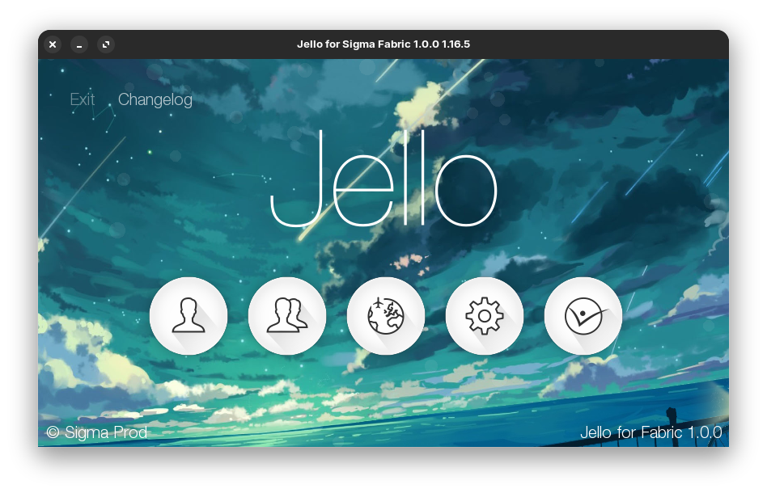
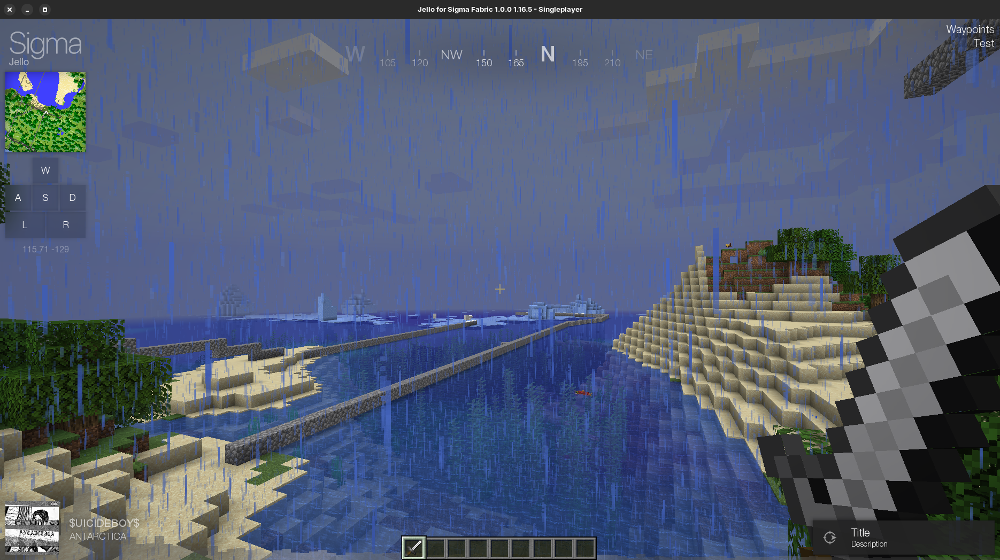
**Use built in playlists**
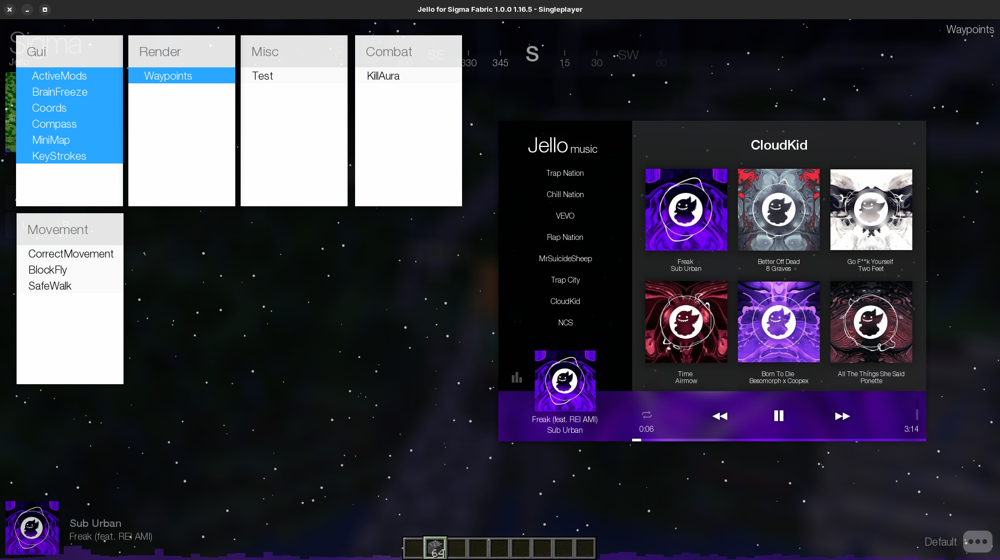
**Search for your own music!**
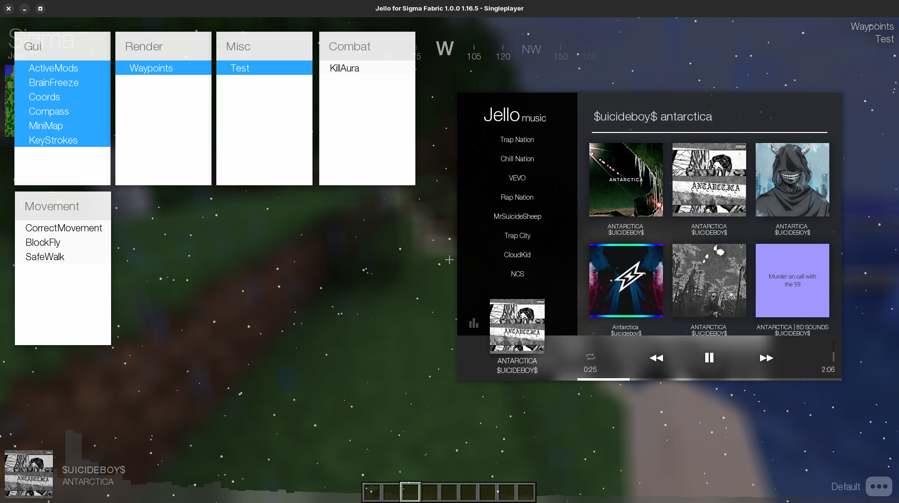
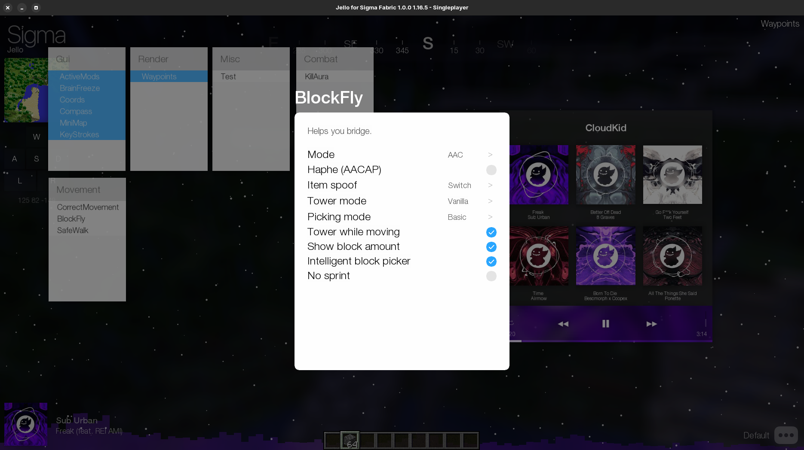
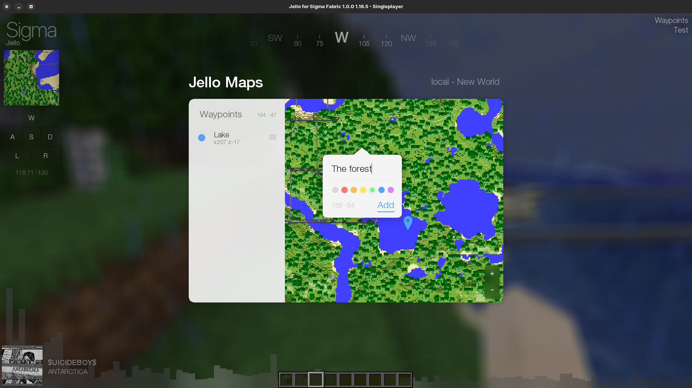
**Enjoy the little things**
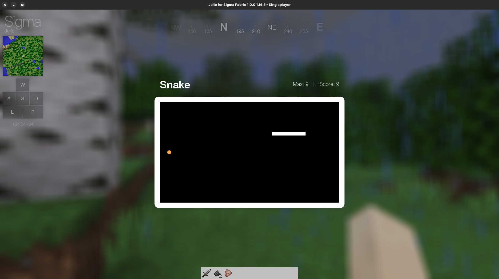
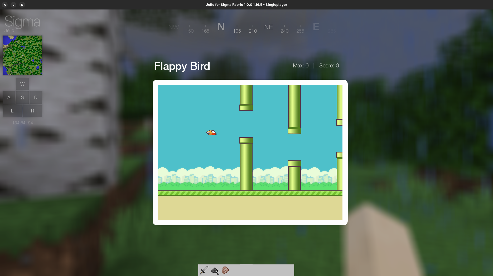
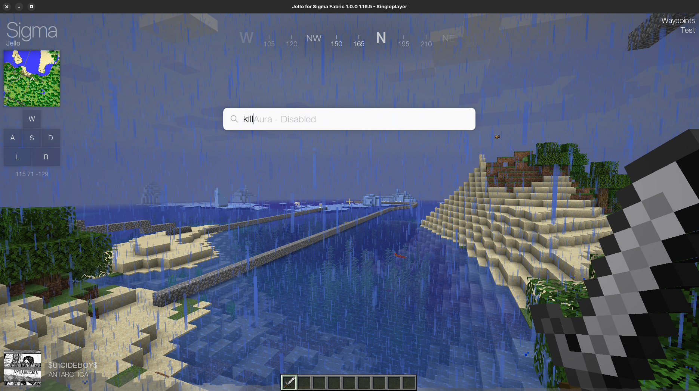
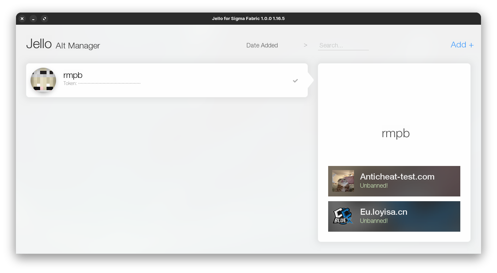
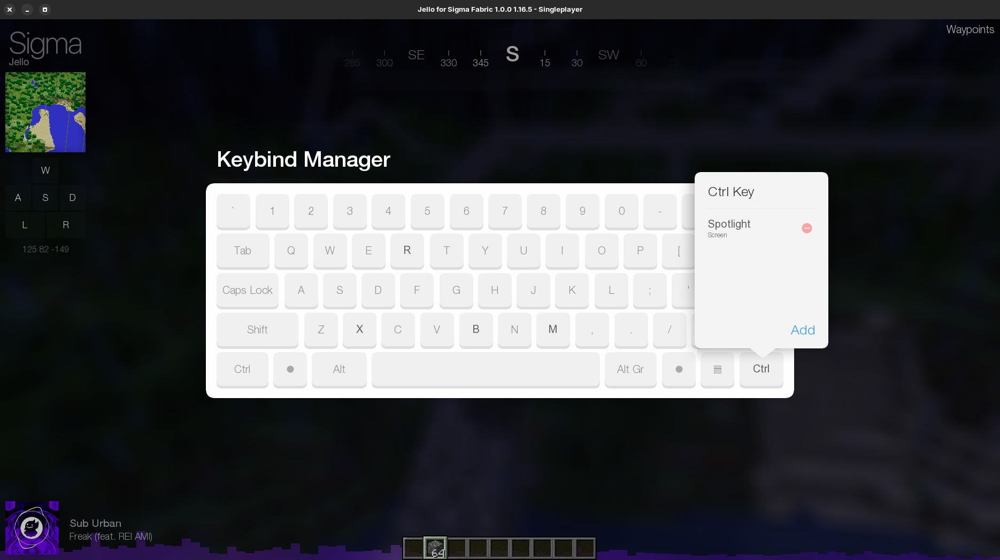
**Change and access Jello options**
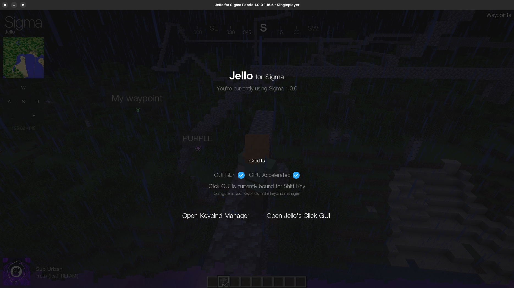
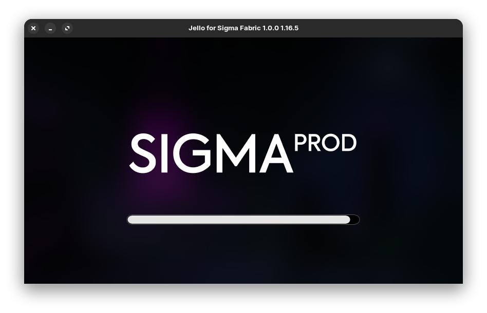